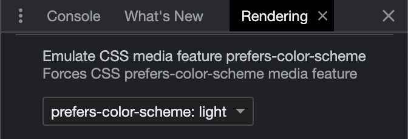

# Patrick Fisher's Resume

This repository is both an example of my work and an interactive resume.

- See the repository source code and its history for an example of my work.
- See it live at <a href="https://pwfisher.github.io/resume/">pwfisher.github.io/resume</a>.

## Features

- Light and dark modes.
  - Test via `prefers-color-scheme` setting in browser dev tools.
    
- Longevity: static deployment at a reliable and free location (GitHub Pages) expected to live long-term.
- Typescript: strict settings and full data spec.
- Components: clean and reusable.

Upcoming:

- Contact info: hidden from search engines.
- Printing: print media support with alternate layout including contact info.

# Development

```zsh
yarn dev
```

Start the development server with `yarn dev` and the app will auto-update as you edit source files.
Open [http://localhost:3000/resume](http://localhost:3000/resume) with your browser to see the result.
(Note that due to the `basePath` of `"resume"`, `http://localhost:3000/` is a 404.)

## GitHub Pages deployment

```zsh
yarn deploy
```

`yarn deploy` will

1. Build to `/out`,
2. Commit `/out` as the root directory of the `gh-pages` branch.
3. Push the `gh-pages` branch.
4. Trigger GitHub Pages deployment from the `gh-pages` branch root, per repo settings.
